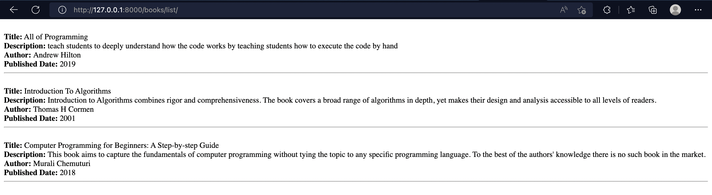
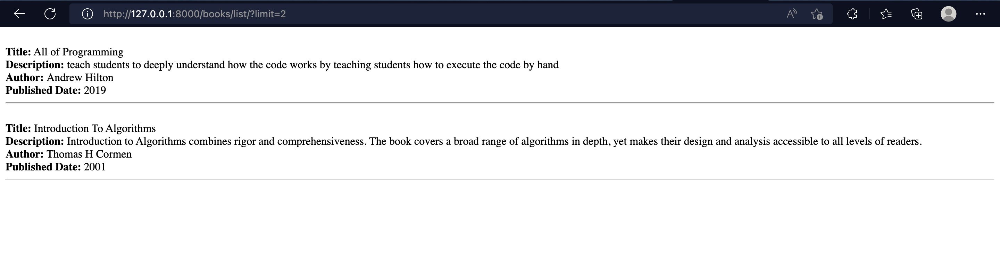

# LAB_PATH_QUERY_PARAMS

Create a project BookStore, this project has two apps :
- [x] books
- [x] recommend


### The books app has the following endpoints :

- [x] books/list
- - This endpoint should return the full list of books

- - Note :  use a query parameters to limit the amount of books returned.


- [x] books/view/book_id
- - This endpoint only shows one book information , use Path Parameters to achieve this.


### The recommend app has one endpoint:
- [x] recommend/random/
This endpoint returns a randomly selected book . 


### Note : Create a calss to represent a book, the book should have the follwoing attributes :
- [x] Class Book
- - title
- - description
- - author
- - publish_date

#### Create several books , add them to a books list to accomplish this project. 
```http://127.0.0.1:8000/books/list/```

```http://127.0.0.1:8000/books/view/1```

```http://127.0.0.1:8000/books/list?limit=2```


```http://127.0.0.1:8000/recommend/random/```
